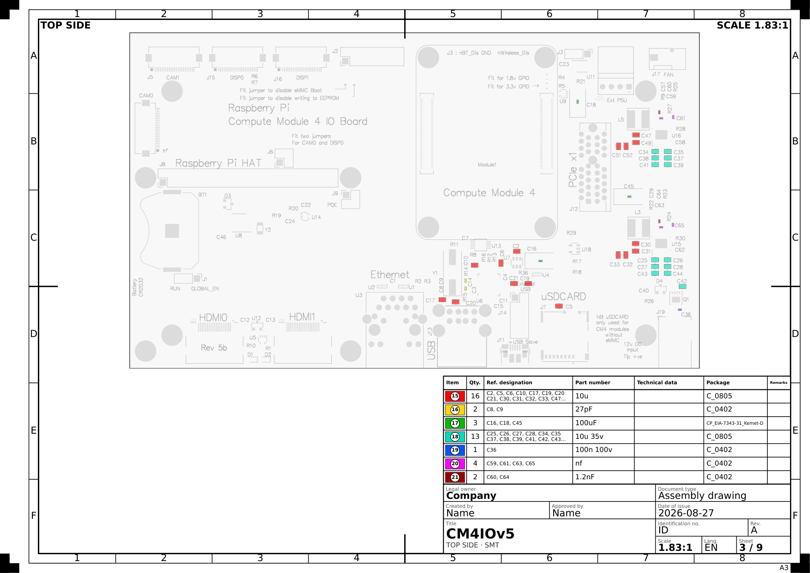
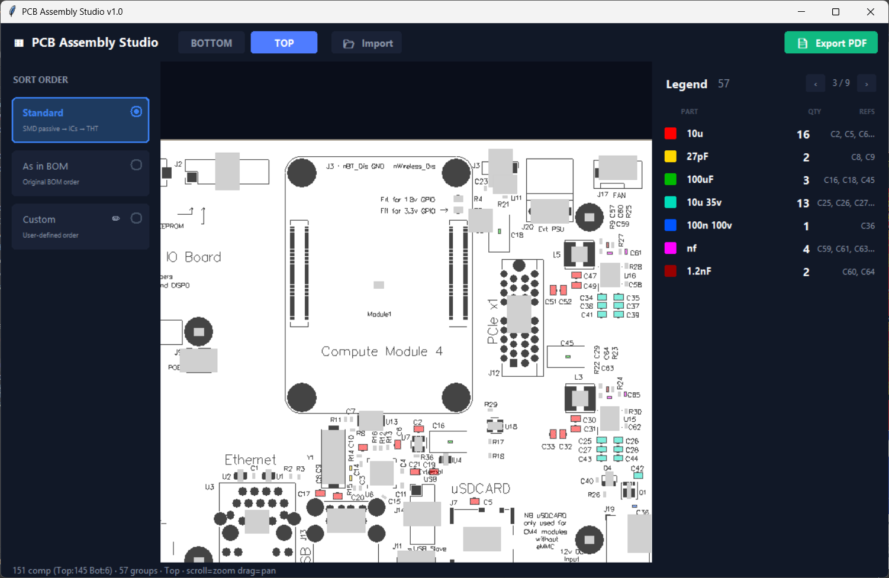

# PCB Assembly Studio

Turn Altium or KiCad outputs — Gerber, BOM, Pick & Place — into multi-page **PCB
assembly drawings**. Interactive board viewer, print-ready PDF export.

**100% offline.** Everything is parsed on your machine. No uploads, no network calls.



*One A3 sheet of the exported PDF — ISO 5457 frame, ISO 7573 parts list, ISO 7200
title block. Each group gets a colour, so every 12K resistor on the board is
found by looking instead of reading designators.*

---

## 📥 Download

**[PCBAssemblyStudio.exe](https://github.com/VitaliyaF/pcb-assembly-studio/releases/latest)** — one file, ~44 MB, double-click. No Python needed.

> Not code-signed, so Windows shows a warning on first run: **More info** → **Run anyway**.

## 🚀 Run from source

1. Install [Python 3.10+](https://www.python.org/downloads/) — tick **"Add Python to PATH"**
2. Green **Code** button above → **Download ZIP** → right-click the ZIP → **Properties** → tick **Unblock** → unzip
3. Double-click **`run.bat`**

> Don't skip the Unblock. Windows silently refuses to run `.bat` files unpacked
> from a downloaded ZIP — `run.bat` would just do nothing when you click it.

`run.bat` installs `matplotlib` and `gerbonara` the first time, then starts the app.
By hand:

```
python -m pip install matplotlib gerbonara
python pcb_assembly_studio.py
```

Optional extras: `openpyxl` for `.xlsx` BOMs, `ezdxf` for DXF, `tkinterdnd2` for
drag-and-drop.

Want your own `.exe`? Double-click `build_exe.bat` → `dist\PCBAssemblyStudio.exe`.

---

## 📋 Input Files

| File | Format | Export from Altium | Required |
|------|--------|--------------------|----------|
| **Pick & Place** | `.txt` `.csv` `.pos` | File → Assembly Outputs → Generates pick and place files | ✅ |
| **BOM** | `.txt` `.csv` `.xlsx` | Reports → Bill of Materials → Export | ✅ |
| **Gerber ZIP** | `.zip` | File → Fabrication Outputs → Gerber Files | Optional |

**Pick & Place** — Altium fixed-width or CSV, KiCad `.pos`. Simple
(`Designator Layer X Y Rotation`) or extended with Comment/Footprint/Description.
Millimeters or mils, auto-detected.

**BOM** — needs **Comment, Description, Designator, Layer**. Two optional
columns are worth exporting:

- **Footprint** (also read as *Package* or *Pattern*) fills the Package column
  of the parts list — the answer to "which 0402 is this?" — and sharpens the
  drawn part outlines, since a name like `USON-10_2.5x1.0mm_P0.5mm` states the
  body size outright. Pad, mask and pitch suffixes are trimmed for display.
- **Part Number** (also *MPN*) fills the Part number column. Placeholders like
  `Generic` or Altium's `[NoParam],` prefix are ignored, and the Comment is
  used when no real number is there.

Technical data comes from Description, but only when it is under 60 characters
— a datasheet paragraph is not table content, and the part is already named by
the two columns beside it. Tab, `;` or `,`
delimiters auto-detected. DNI / DNP / "Do not place" parts are listed separately
with a ⛔ marker and get their own PDF pages; Russian markers
("НЕ УСТАНАВЛИВАТЬ", "НЕ СТАВИТЬ") count too, and cp1251 files decode correctly.
A Comment of exactly `nf` or `dnf` counts as not-fitted as well — the whole
field has to be that word, so `100 nF` and `1.2nF` stay on the board.

**Gerber ZIP** — layers by extension: `.GTO`/`.GBO` silkscreen, `.GTS`/`.GBS`
solder mask, `.GM1`–`.GM4`/`.GKO` outline. Cyrillic filenames inside the ZIP are fine.

---

## 🖥️ What You Get



**Viewer** — scroll to zoom, drag to pan. Gerber artwork as the background, colored
component highlights, pin-1 markers on ICs, bottom layer auto-mirrored.

**Legend** — 7 groups per page. Hover a row to light those parts up on the board,
hover REFS for the full designator list.

**Sort order** — Standard (SMD passives → semiconductors → ICs → THT), as in BOM,
or your own prefix order.

**PDF** — a proper ISO technical drawing (see below), 7 colors per page (red,
yellow, green, cyan, blue, magenta, dark red), board artwork from Gerber.

---

## 📐 ISO Drawing Format

Every exported sheet is laid out as a technical drawing, not a screenshot.

| Element | Standard |
|---------|----------|
| **Sheet** — A4 / A3 / A2, landscape or portrait; 20 mm filing margin on the left, 10 mm elsewhere | ISO 5457 |
| **Grid reference border** — 50 mm zones lettered A… down and numbered 1… across, plus centring and trimming marks | ISO 5457 |
| **Title block** — 180 mm wide, bottom right: legal owner, title, identification no., revision, date of issue, created/approved by, document type, scale, language, sheet *n* / *m* | ISO 7200 |
| **Parts list** — item, qty, ref. designation, part number, technical data, package, remarks | ISO 7573 |
| **Item numbers** — encircled numerals on the colour key | ISO 6433 |
| **Line widths** — 0.7 / 0.5 / 0.35 / 0.25 mm; **lettering** — 1.8 / 2.5 / 3.5 / 5 mm | ISO 128-20, ISO 3098 |
| **Scale** — a real one from the 2 / 5 / 10 series, printed as `SCALE 1:1` | ISO 5455 |

**The scale is real.** The page is exactly 210 × 297 mm (or 420 × 297, …) and the
board is drawn at the chosen ratio, so a sheet printed at 100 % can be laid next
to the board and measured. `auto` picks the largest standard scale that fits;
`fit` fills the view area instead and reports the resulting intermediate ratio.

Two deliberate departures from the letter of the standards:

- ISO 5457 allows A4 only upright and A3–A0 only landscape. The export dialog
  offers both orientations for every size, and says so when you deviate.
- ISO 7573 puts the parts-list header against the title block, which means
  reading the items upward. The header is at the top here and the items read
  downward, the way anyone actually reads a table.

The **Drawing setup** dialog on export sets the sheet, the scale mode and the
title-block fields, and shows the resulting sheet size and scale as you change
them.

---

## ⚠️ Limitations

- Component sizes are estimated from description/package text. Load Gerbers for real pad geometry.
- Pin-1 markers come from Pick & Place rotation. Unusual library footprint orientation can put the marker in the wrong corner — check against your design.
- DWG needs ODA File Converter. Export DXF from Altium instead, or use a Gerber ZIP.

---

## 🌍 Drawing Language

The GUI is English-only, but text **inside the generated PDF** is localisable.
Set `LANG = "ru"` in `pcb_assembly_studio.py` for bilingual Russian/English table
headers. Only the drawing changes.

---

## 📝 Changelog

**v1.1** — ISO-format drawings. Sheet size (A4/A3/A2) and orientation are now
chosen on export; the sheet follows ISO 5457 (border, frame, grid reference
zones, centring and trimming marks), the title block follows ISO 7200, the
legend became an ISO 7573 parts list, and the board is drawn at a real ISO 5455
scale instead of being stretched to fit. The parts list gained **Part number**,
**Technical data** and **Package** columns fed by the BOM, and the title block
gained fields for legal owner, identification number, date of issue and
approver.

**v1.0** — Initial public release
